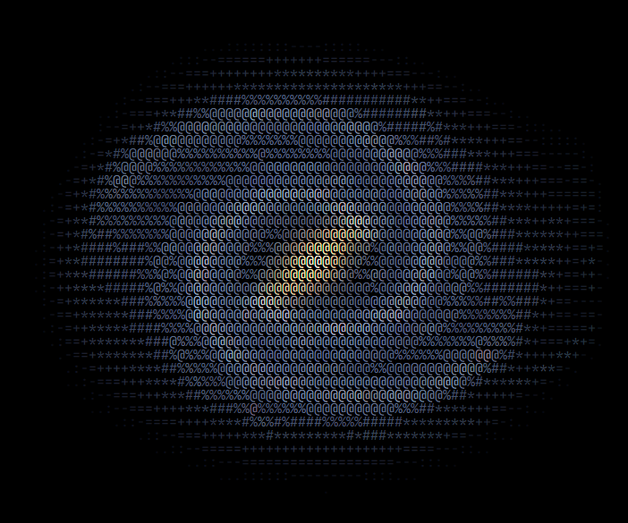

# 📟 ChromaASCII

<div align="center">
  
  <br>
  <strong>A High-Performance, Full-Color ASCII Video & Image Engine</strong>
  <br>
  <i>Transform pixels into vibrant terminal-art with a specialized high-efficiency protocol.</i>
</div>

---

## 📽️ Preview

### 🌌 Image Comparison
| Original Image | ChromaASCII Reconstruction |
| :---: | :---: |
|  |  |

### 🎬 Video & UI Preview
| Real-time Video | Application Interface |
| :---: | :---: |
|  |  |

---

## ✨ Key Capabilities

*   **🚀 Performance Optimized** – Optimized CPU processing using `Uint32Array` color packing and raw buffer manipulation. No GPU required.
*   **🌈 Full RGB Fidelity** – Beyond standard grayscale. Adaptive bit-depth control (4-bit to 12-bit) for the perfect balance of quality and size.
*   **🦄 Rainbow Mode** – Procedural, resolution-aware spatial color mapping for vibrant, stable aesthetics without image source dependency.
*   **🎬 Delta-Compression Engine** – Our custom `.ascv` protocol only stores changed pixels between frames, making long ASCII videos viable.
*   **📦 Zero-Dependency Core** – Built with pure Vanilla JS. No bulky libraries, just efficient logic and native browser APIs.
*   **🛰️ Cross-Platform Decoder** – Port your ASCII animations anywhere with the lightweight standalone decoder.

---

## 📟 The .ASCV Protocol (Architecture & Efficiency)

Standard media formats (MP4, PNG, JPG) are designed to compress *pixels*. **ChromaASCII** is designed to compress *intent*. We developed the `.ascv` (ASCII-Vector) protocol to handle high-density character grids with specialized delta-encoding.

### 📊 Comparative Analysis
*Measured using a single 150-resolution colored frame (Rendered at 900x900px)*

| Format | Method | Payload Size | Compression |
| :--- | :--- | :--- | :--- |
| **🚫 Base64** | Text-Encoded ASCII | **~260 KB** | 133% (Extreme Overhead) |
| **📄 Raw JSON** | Plain Metadata | **~200 KB** | 100% (The Reference) |
| ** GZIP** | Standard Compression | **~80 KB** | 40% (General Purpose) |
| **📟 .ASCV.GZ** | **Custom Protocol** | **~12 KB** | **6% (Hyper-Efficiency)** |
| **🌑 MONO** | **Binary Encoding** | **~2 KB** | **1% (Ultimate Optimization)** |

### 🚀 Why `.ascv` is the Superior Choice

#### 1. Semantic Intelligence
A PNG compressor doesn't know what a '█' character is. It sees it as a grid of pixels. **ChromaASCII** knows exactly where characters start and end, allowing us to store metadata instead of raw raster data.

#### 2. Infinite Resolution (Vector-Like)
Because we store instructions rather than pixels, you can scale your output to **8K or beyond** without losing a single edge. The 10KB file doesn't define piksels; it defines the grid, making it functionally closer to a vector format than a video format.

#### 3. Lossless Delta-Compression
In Video Mode, we don't store full frames. We store the "Color-Text Shift"—only the differences between frames. This mathematical approach allows minutes of colorful ASCII video to fit into just a few Megabytes.

---

## 🎨 Rendering Modes

- **Grayscale**: Density-based mapping for that classic look.
- **Bayer Dithering**: 4x4 ordered dithering for crisp, retro textures.
- **Binary**: Ultra-high contrast for terminal enthusiasts (includes adjustable **Threshold** control).
- **Block Mode (2x1)**: Double your vertical resolution using half-block characters (`█`, `▀`, `▄`) for a pixel-perfect aesthetic.
- **Monochrome Optimization**: Binary data packing that eliminates color overhead for pure character-based art.
- **High-Speed UI**: Segmented controls for instantaneous mode switching.

---

## 🚀 Quick Start

### Encoder (Browser)
```javascript
import { AsciiProcessor } from './core/AsciiProcessor.js';

const processor = new AsciiProcessor();
processor.setSource(videoElement);
processor.options.resolution = 120; // Width in chars
processor.process();

// Access the result
const frame = processor.currentFrameData;
// Returns: { text, colors, width, height }
```

### Decoder (Playback)
```javascript
import { VideoDecoder } from './core/VideoDecoder.js';

const decoder = new VideoDecoder();
await decoder.load(fileBlob);

decoder.play((frame) => {
    // Highly optimized static renderer
    AsciiProcessor.drawFrame(canvasContext, frame);
});
```

---

## 🔧 Technical Stack
- **Native Streams API**: For real-time Gzip (de)compression.
- **TypedArrays**: Precise memory management for color data.
- **Bayer-Thresholding**: High-quality light-to-density mapping.
- **Delta-Diffing Algorithm**: Lossless inter-frame compression.

---

## 📄 License
MIT © 2025 **ChromaASCII** - Created with ❤️ for ASCII art and compression efficiency.
