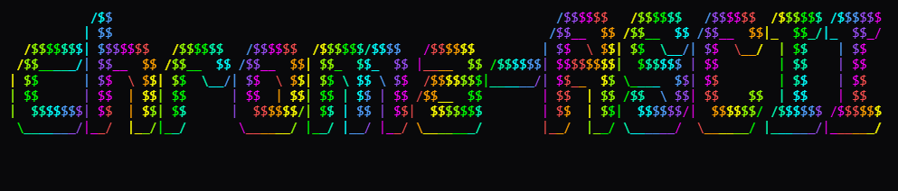
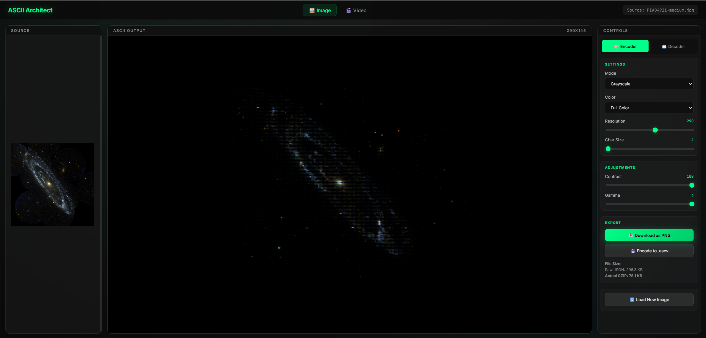

# 📟 ChromaASCII

<div align="center">
  
  <br>
  <strong>A High-Performance, Full-Color ASCII Video & Image Engine</strong>
  <br>
  <i>Transform pixels into vibrant terminal-art with a specialized high-efficiency protocol.</i>
</div>

---

## 📽️ Preview

<div align="center">
  
  
  <br>
  <sub><i>Left: High-resolution colored image conversion. Right: Real-time video processing with delta encoding.</i></sub>
</div>

---

## ✨ Key Capabilities

*   **🚀 Extreme Performance** – Optimized CPU processing using `Uint32Array` color packing and raw buffer manipulation. No GPU required (but GPU-friendly).
*   **🌈 Full RGB Fidelity** – Beyond standard grayscale. Every character carries its own 24-bit color data for stunning visual accuracy.
*   **🎬 Delta-Compression Engine** – Our custom `.ascv` protocol only stores changed pixels between frames, making long ASCII videos viable.
*   **� Zero-Dependency Core** – Built with pure Vanilla JS. No bulky libraries, just efficient logic and native browser APIs.
*   **�️ Cross-Platform Decoder** – Port your ASCII animations anywhere with the lightweight standalone decoder.

---

## 🛠️ The .ASCV Ecosystem

Standard image formats weren't built for ASCII. We created the `.ascv` (ASCII-Vector) protocol to treat text and color data as first-class citizens.

### 📊 Efficiency Benchmarks
*Tested with a 150-resolution colored source (Single Frame)*

| Format | Storage Method | Size | Advantage |
| :--- | :--- | :--- | :--- |
| **🚫 Base64** | Text-encoded raw data | **~260 KB** | Inefficient (+33% Bloat) |
| **📄 Raw JSON** | Plain text object | **~200 KB** | Baseline |
| **🖼️ PNG** | 900x900 Pixel Grid | **33.8 KB** | Heavy Raster |
| **📟 .ASCV.GZ** | **Our Optimized Logic** | **10.2 KB** | **The Winner (3x Better)** |

> **Why it wins:** Traditional formats like PNG try to compress every tiny pixel. **ChromaASCII** understands the underlying character grid and optimizes for "Differences" and "Sparse Colors."

### 🧠 Logic vs. Pixels
While a 150x150 PNG might seem small, it blurs when upscaled. **.ASCV** stores the *intent* of the data. A **10KB** file can generate a **razor-sharp 4K ASCII output** because it's rendering vectors/characters, not stretching pixels.

---

## 🎨 Rendering Modes

- **Grayscale**: Density-based mapping for that classic look.
- **Bayer Dithering**: 4x4 ordered dithering for crisp, retro textures.
- **Binary**: Ultra-high contrast for terminal enthusiasts.
- **Block Mode (2x1)**: Double your vertical resolution using half-block characters (`█`, `▀`, `▄`) for a pixel-perfect aesthetic.

---

## 🚀 Quick Start

### Encoder (Browser)
```javascript
import { AsciiProcessor } from './core/AsciiProcessor.js';

const processor = new AsciiProcessor();
processor.setSource(videoElement);
processor.options.resolution = 120; // Width in chars
processor.process();

// Access the result
const frame = processor.currentFrameData;
// Returns: { text, colors, width, height }
```

### Decoder (Playback)
```javascript
import { VideoDecoder } from './core/VideoDecoder.js';

const decoder = new VideoDecoder();
await decoder.load(fileBlob);

decoder.play((frame) => {
    // Highly optimized static renderer
    AsciiProcessor.drawFrame(canvasContext, frame);
});
```

---

## 🔧 Technical Stack
- **Native Streams API**: For real-time Gzip (de)compression.
- **TypedArrays**: Precise memory management for color data.
- **Bayer-Thresholding**: High-quality light-to-density mapping.
- **Delta-Diffing Algorithm**: Lossless inter-frame compression.

---

## 📄 License
MIT © 2025 **ChromaASCII** - Created with ❤️ for ASCII art and compression efficiency.
